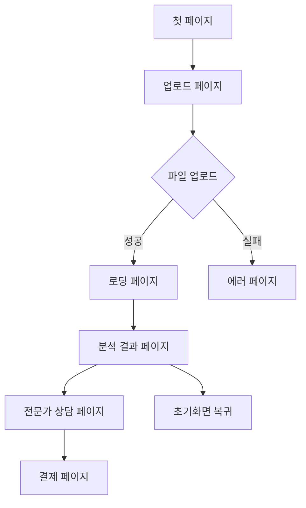

# Knock-FE 🏠

**부동산 등기부등본 AI 분석 서비스** - React + TypeScript + Vite + TailwindCSS + TanStack Query + Zustand

> 복잡한 등기부등본을 AI가 분석하여 부동산 거래의 위험도를 쉽게 파악할 수 있는 웹 애플리케이션입니다.

## 📋 목차

- [프로젝트 소개](#-프로젝트-소개)
- [주요 기능](#-주요-기능)
- [기술 스택](#-기술-스택)
- [애플리케이션 플로우](#-애플리케이션-플로우)
- [프로젝트 구조](#-프로젝트-구조)
- [설치 및 실행](#-설치-및-실행)
- [주요 컴포넌트](#-주요-컴포넌트)
- [페이지 구성](#-페이지-구성)

## 🏡 프로젝트 소개

Knock은 부동산 거래 시 필수적으로 확인해야 하는 **등기부등본을 AI가 자동으로 분석**하여, 일반인도 쉽게 이해할 수 있도록 **위험도를 시각화**해주는 서비스입니다.

### 해결하는 문제

- 복잡한 등기부등본 해석의 어려움
- 부동산 거래 시 숨겨진 위험 요소 파악 부족
- 전문 용어로 인한 일반인의 접근성 부족

### 제공하는 가치

- **AI 기반 자동 분석**: 등기부등본 업로드만으로 즉시 분석
- **직관적인 위험도 표시**: 퍼센트와 시각적 차트로 위험도 제공
- **전문가 상담 연계**: 필요시 전문가와 직접 상담 가능
- **단계별 발급 가이드**: 등기부등본 발급 방법 제공

## ✨ 주요 기능

### 1. 등기부등본 업로드 및 분석

- PDF 파일 드래그 앤 드롭 업로드
- 실시간 파일 유효성 검증
- AI 기반 자동 분석 (약 30초 소요)

### 2. 위험도 시각화

- **위험도 퍼센트 표시**: 0-100% 척도로 위험도 제공
- **인터랙티브 차트**: 애니메이션이 포함된 원형 진행바
- **상세 분석 결과**: 표제부, 갑구, 을구별 상세 내용

### 3. 전문가 상담

- 분석 결과 기반 전문가 매칭
- 실시간 상담 신청
- 전문가 프로필 및 리뷰 확인

### 4. 사용자 가이드

- **용어 설명**: 어려운 부동산 용어 해설
- **발급 가이드**: 등기부등본 발급 과정 단계별 안내
- **반응형 툴팁**: 호버 시 도움말 제공

## 🛠 기술 스택

### Frontend Framework

- **React 19**: 최신 React 기능 활용
- **TypeScript**: 타입 안정성 확보
- **Vite**: 빠른 개발 환경

### 스타일링 & UI

- **TailwindCSS 4.x**: 유틸리티 퍼스트 CSS
- **Framer Motion**: 부드러운 애니메이션
- **Responsive Design**: 모바일/데스크탑 대응

### 상태 관리 & 데이터

- **Zustand**: 경량 상태 관리
- **TanStack Query**: 서버 상태 관리
- **Axios**: HTTP 클라이언트

### 개발 도구

- **ESLint**: 코드 품질 관리
- **React Router**: 클라이언트 사이드 라우팅

## 🔄 애플리케이션 플로우



### 상세 플로우

1. **첫 페이지 (FirstPage)**

   - 서비스 소개 및 시작 버튼
   - 모바일/데스크탑 반응형 레이아웃

2. **업로드 페이지 (UploadPage)**

   - PDF 드래그 앤 드롭 영역
   - 파일 유효성 검증 (10MB 제한)
   - 등기부등본 발급 가이드 (8단계)
   - 실시간 도움말 툴팁

3. **로딩 페이지 (LoadingPage)**

   - AI 분석 진행 상황 표시
   - 분석 과정 시각화
   - 예상 완료 시간 안내

4. **결과 페이지 (ResultPage)**

   - **위험도 차트**: 애니메이션 원형 진행바
   - **상세 분석**: 표제부/갑구/을구 내용
   - **전문가 상담 버튼**: 추가 도움 요청
   - **용어 설명**: 복잡한 용어 해설

5. **전문가 페이지 (ExpertPage)**

   - 전문가 프로필 목록
   - 리뷰 및 평점 시스템
   - 상담 신청 기능

6. **결제 페이지 (PaymentPage)**
   - 상담 서비스 결제
   - 다양한 결제 수단 지원

## 📁 프로젝트 구조

```
src/
├── assets/           # 정적 리소스
│   ├── icons/       # SVG 아이콘 컴포넌트
│   └── flow/        # 발급 가이드 이미지
├── components/       # 재사용 가능한 컴포넌트
│   ├── BackButton.tsx
│   ├── Button.tsx
│   ├── ConfirmModal.tsx
│   ├── ConsultationModal.tsx
│   ├── CountText.tsx
│   ├── ExpertCard.tsx
│   ├── PageHeader.tsx
│   ├── PdfDropbox.tsx
│   ├── ResultQuestionButton.tsx  # 용어 설명
│   ├── ScoreProgress.tsx         # 위험도 차트
│   ├── TextSlide.tsx
│   ├── TextSwiper.tsx
│   ├── TypographyText.tsx
│   └── UploadQuestionButton.tsx  # 발급 가이드
├── contents/         # 페이지별 컨텐츠
│   ├── DesktopContent.tsx
│   ├── ExpertContent.tsx
│   ├── MobileContent.tsx
│   └── ResultContent.tsx
├── hooks/           # 커스텀 훅
│   └── useUploadDeed.ts
├── layouts/         # 레이아웃 컴포넌트
│   ├── DesktopLayout.tsx
│   └── MobileLayout.tsx
├── pages/           # 페이지 컴포넌트
│   ├── ErrorPage.tsx
│   ├── ExpertPage.tsx
│   ├── FirstPage.tsx
│   ├── LoadingPage.tsx
│   ├── PaymentPage.tsx
│   ├── ResultPage.tsx
│   └── UploadPage.tsx
├── store/           # 상태 관리
│   └── useDeedUploadStore.ts
└── utils/           # 유틸리티 함수
    └── format.ts
```

## 🚀 설치 및 실행

### 개발 환경 설정

```bash
# 저장소 클론
git clone https://github.com/Hackathon-ROKANF/Knock-FE.git
cd Knock-FE

# 의존성 설치
npm install
# 또는
yarn install

# 개발 서버 실행
npm run dev
# 또는
yarn dev
```

### 빌드 및 배포

```bash
# 프로덕션 빌드
npm run build
# 또는
yarn build

# 빌드 결과 미리보기
npm run preview
# 또는
yarn preview

# 린터 실행
npm run lint
# 또는
yarn lint
```

## 🧩 주요 컴포넌트

### ScoreProgress

위험도를 시각적으로 표현하는 원형 진행바 컴포넌트

```tsx
<ScoreProgress
  riskProbability='25%'
  size={240}
  strokeWidth={14}
  animationDuration={2.5}
/>
```

### PdfDropbox

등기부등본 파일 업로드를 위한 드래그 앤 드롭 컴포넌트

```tsx
<PdfDropbox maxSizeMb={10} />
```

### QuestionButton (2가지 버전)

- **UploadQuestionButton**: 등기부등본 발급 가이드
- **ResultQuestionButton**: 용어 설명

### ExpertCard

전문가 정보를 표시하는 카드 컴포넌트

## 📱 페이지 구성

### 반응형 디자인

- **모바일 우선**: 320px ~ 768px
- **데스크탑 대응**: 768px 이상
- **Tailwind CSS**: `md:` 브레이크포인트 활용

### 애니메이션

- **Framer Motion**: 페이지 전환 및 요소 애니메이션
- **부드러운 전환**: 사용자 경험 향상
- **성능 최적화**: GPU 가속 활용

### 접근성

- **ARIA 라벨**: 스크린 리더 지원
- **키보드 네비게이션**: 접근성 향상
- **의미론적 HTML**: SEO 및 접근성

## 🌐 배포

- **Vercel**: 자동 배포 및 CI/CD
- **도메인**: [서비스 URL]
- **환경 변수**: API 엔드포인트 설정

## 👥 팀 정보

### 해커톤 ROKANF 팀

- Frontend Developer
- Backend Developer
- AI/ML Engineer
- Designer

## 📄 라이선스

이 프로젝트는 MIT 라이선스 하에 배포됩니다.
